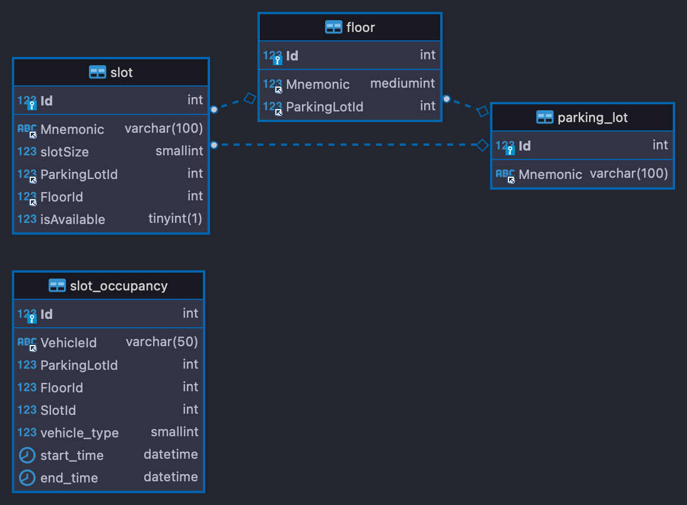
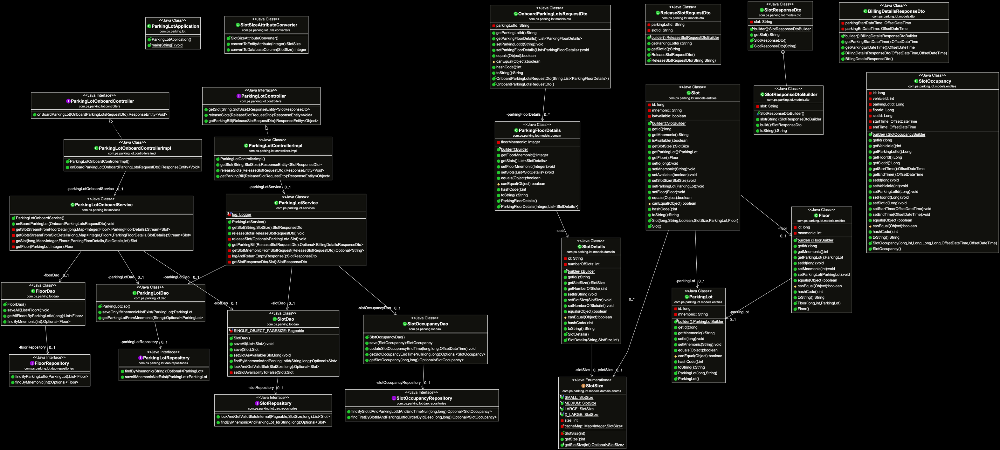

# LLD of parking lot
# Problem Statement

Building and designing cloud ready/Deployable parking lot.
1. On Board a new Parking lot to the system
    - The number of Parking Slots.
    - Size of slots { Small, Large, Medium, X-Large }
        - Number of slots for each size
    - Parking Floors, number of Slots on each floor with size.

2. When a car arrives at the gate
    - We need to allocate it the slot number which should be printed on the parking ticket
      - Slot Number Template – [ FloorID:Bay ID ]
    - If a Small car arrives and:
      - If we have a small slot then we should allocate a Small Slot
      - If No Small slot if free then Medium slot
      - If No Medium is free then Large slot
      - If no Large is free then XLarge slot
      - If no XLarge is available then don’t print the slot, print no SLOT FOUND
    - If a Large car arrives then we start with Large then Xlarge
    - If a Medium car arrives, we start with Medium, then large then XLarge
    - If a Large car arrives then Large, followed by Xlarge If no large is free
    - If an Xlarge car arrives then it needs to be Xlarge slot.

    - The goal is to get the smallest slot that can fit the car.

3. When the car leaves the gate
    - Mark the slot as free to be made available for the next car.

# Thought proccess
 - ### Onboarding the parkingLots
    - For onboarding the parking slot fist we need to onboard the "parking lot(basically the location)" then the number of floors and then we can associate and onboard the parking slots.
 - ### Retriving the parking slot
    - The main problem arises while retrieving the slots is concurrent access i.e if multiple vehicles wants to access parking lots at same time there might be possibility that same slot will be allocated to multiple vehicles 
    - To mitigate this issue Current project algorithm will use the concept of row level locks.
    - Basically at any point of time The algorithm will lock the only the column that match's the given rules for selecting the slot and update that row to slot booked and releases the lock.
    - With this way there is no need to handle from application level so that there wont be any thread locking or synchronize code blocks not needed.
    - With the current algorithm Slot selection is executed in DB layer with SQL so there is no overhead on application layer to use custom datastructure to pick best suitable slots.
    - With this the solution will become highly scalable and performers better than the application level handling algorithms.
      
# DB Design

# UML Diagram

# System requirements

Docker, Mysql server, maven, git and Java 17 needs to preset before running this application.

### SetUp

1. Run the Docker and should be running
2. Checkout the project and run `mvn clean install` in root of the project.
3. A docker image will be created on successful build.
