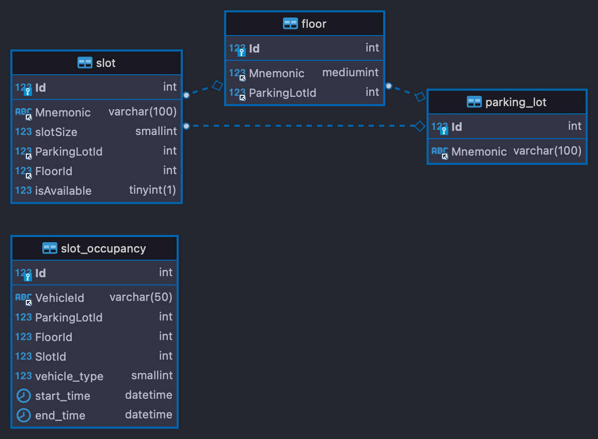

# Read Me First

The following was discovered as part of building this project:

* The original package name 'com.ps.parking-lot' is invalid and this project uses 'com.ps.parkinglot' instead.

# Getting Started

### Reference Documentation

For further reference, please consider the following sections:

* [Official Apache Maven documentation](#guides)
* [Spring Boot Maven Plugin Reference Guide](https://docs.spring.io/spring-boot/docs/3.0.2/maven-plugin/reference/html/)
* [Create an OCI image](https://docs.spring.io/spring-boot/docs/3.0.2/maven-plugin/reference/html/#build-image)
* [Spring Configuration Processor](https://docs.spring.io/spring-boot/docs/3.0.2/reference/htmlsingle/#appendix.configuration-metadata.annotation-processor)
* [Spring Boot DevTools](https://docs.spring.io/spring-boot/docs/3.0.2/reference/htmlsingle/#using.devtools)
* [Jersey](https://docs.spring.io/spring-boot/docs/3.0.2/reference/htmlsingle/#web.servlet.jersey)
* [Validation](https://docs.spring.io/spring-boot/docs/3.0.2/reference/htmlsingle/#io.validation)
* [Spring Boot Actuator](https://docs.spring.io/spring-boot/docs/3.0.2/reference/htmlsingle/#actuator)
* [Spring Data JPA](https://docs.spring.io/spring-boot/docs/3.0.2/reference/htmlsingle/#data.sql.jpa-and-spring-data)

### Guides

The following guides illustrate how to use some features concretely:

* [Validation](https://spring.io/guides/gs/validating-form-input/)
* [Building a RESTful Web Service with Spring Boot Actuator](https://spring.io/guides/gs/actuator-service/)
* [Accessing Data with JPA](https://spring.io/guides/gs/accessing-data-jpa/)

# System requirements:

Docker, Mysql server, maven, git and Java 17 needs to preset before running this application.

### SetUp

1. Run the Docker and should be running
2. Checkout the project and run `mvn clean install` in root of the project.
3. A docker image will be created on successful build.

# DB Design

